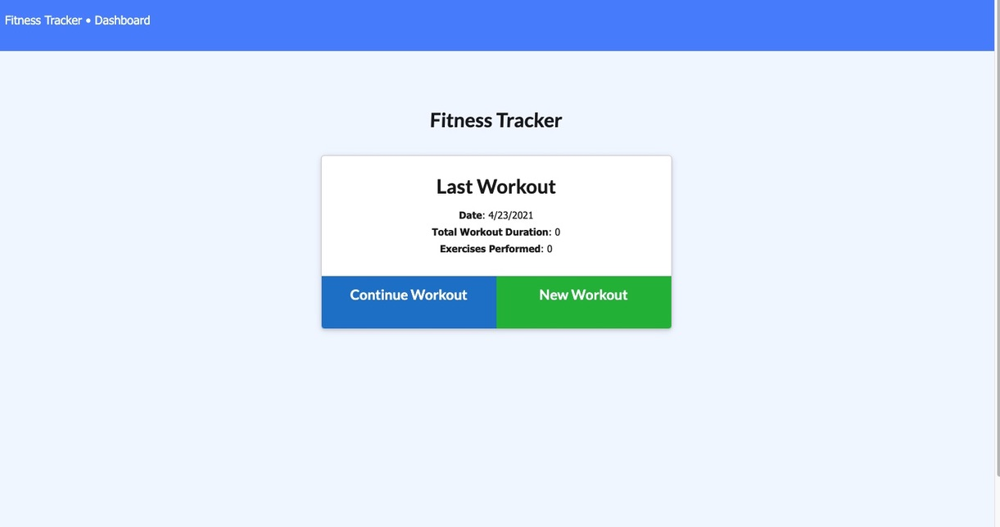
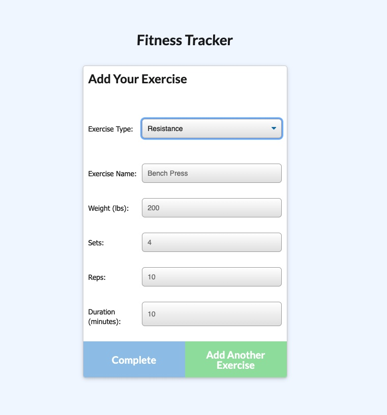
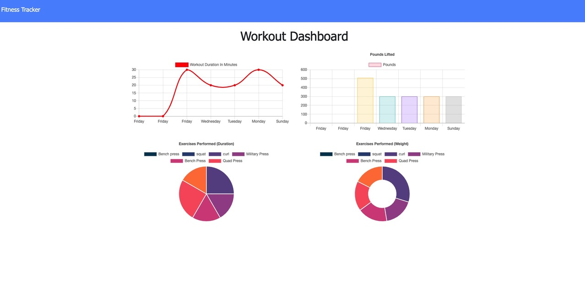

# Fitness Tracker

## Table of Contents
* [Installation](#installation)
* [Usage](#usage)
* [License](#license)
* [Questions](#questions)

## Description
Link to heroku deployed application: https://mighty-anchorage-53908.herokuapp.com/

This is a workout tracker for helping users track their resistance and cardiop workouts throughout the week. Stats are aggregated and posted to a stats page, and they are input in a workout input page that users can add new exercises to. This application uses an Express server deployed to Heroku, and a Mongo database for a NoSQL database. The front end is code developed by Trilogy, is HTML, CSS, and JS and Chart.js.

Here are pictures of the deployed application
 

 

## Usage
Go to https://mighty-anchorage-53908.herokuapp.com/ to use the application

Click New workout to create a new workout, or Continue Workout to add new the previous workout.

Add in the stats for the workout, then click Add another exercise to keep adding to the workout, or Complete to Finish. 

See the stats of your weekly workouts on the Dashboard page, in the link on the top left. 

## License
This repository is licensed under the MIT: (https://opensource.org/licenses/MIT) license.

